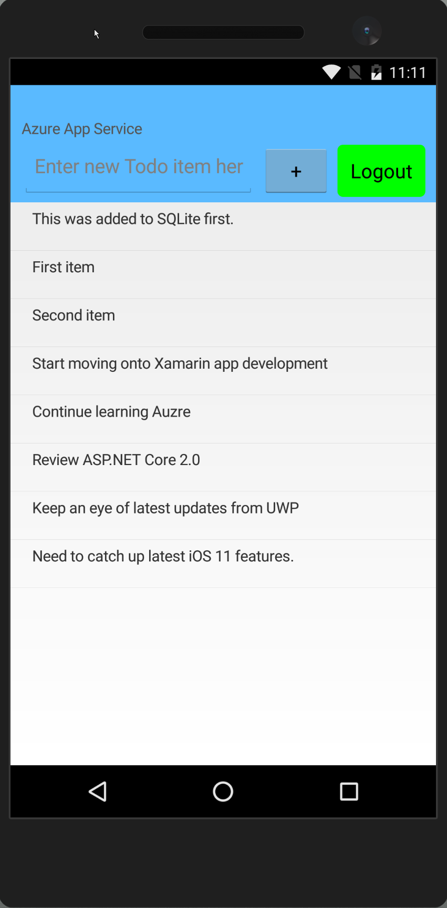

# TodoAzureAuth #

This is updated version of original version from [TodoAzureAuth](https://developer.xamarin.com/samples/xamarin-forms/WebServices/TodoAzureAuth/). The reason that I did not create fork version from [TodoAzureAuth Code](https://github.com/xamarin/xamarin-forms-samples/tree/master/WebServices/TodoAzureAuth) is I was not able to solve a lot of issues from nuget packages updates. 

### Steps: ###

1. [Create a Xamarin.Forms app](https://docs.microsoft.com/en-gb/azure/app-service-mobile/app-service-mobile-xamarin-forms-get-started)
2. [Add authentication to your Xamarin Forms app](https://docs.microsoft.com/en-gb/azure/app-service-mobile/app-service-mobile-xamarin-forms-get-started-users) 
3. [Enable offline sync for your Xamarin.Forms mobile app](https://docs.microsoft.com/en-gb/azure/app-service-mobile/app-service-mobile-xamarin-forms-get-started-offline-data) 

## Screenshots

### Here are more references. ###

- [Authenticating Users with Azure Mobile Apps](https://developer.xamarin.com/guides/xamarin-forms/cloud-services/authentication/azure/) 
- [TodoAzureAuthOfflineSync](https://github.com/xamarin/xamarin-forms-samples/tree/master/WebServices/TodoAzureAuthOfflineSync)

#### Contributors
* [Bozhi Qian](https://github.com/bozhiqian)